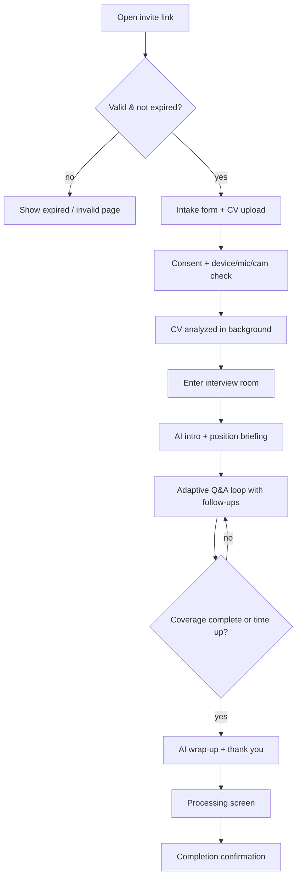
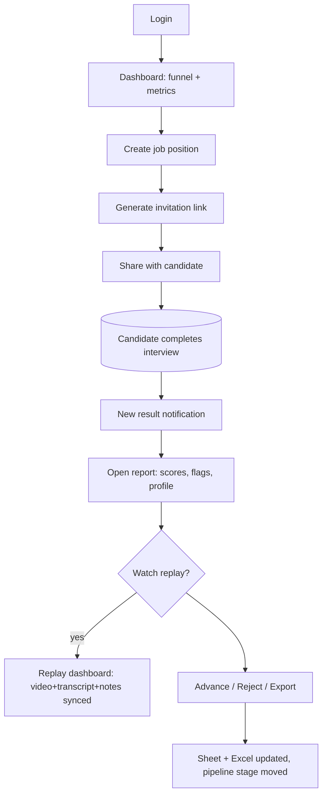

# 01 — Product Overview

## Vision

Replace the **first HR screening round** with a fully autonomous AI interview agent that conducts
a realistic 1‑on‑1 interview, evaluates the candidate like a senior HR manager would, and hands
HR a ranked, evidence-backed decision packet — at any hour, in minutes, at scale.

Watad AI Interviewer is the screening funnel's top stage: hundreds of applicants in, a
shortlist of qualified, de‑risked candidates out, each with a transparent scorecard, behavioral
profile, red‑flag list, PDF report, and a row in the hiring sheet.

## Who uses it

| Persona | Goal | Primary screens |
|---|---|---|
| **Super Admin** | Configure platform, manage users, avatars, integrations | Settings, Users, Avatars, Audit |
| **HR Manager** | Own pipelines, review results, make decisions | Dashboard, Candidates, Reports |
| **Recruiter** | Create jobs, invite candidates, triage | Jobs, Invitations, Candidate list |
| **Department Manager** | Review shortlisted candidates for their dept | Filtered dashboard, Reports |
| **Interviewer Viewer** | Read-only access to results | Reports, Replay |
| **Candidate** (external) | Complete the interview | Intake form, Interview room |

## Core business flow

```
1. HR creates a Job Position (title, department, seniority, requirements, salary range).
2. HR generates an interview invitation → unique public link (optionally emailed/WhatsApped).
3. Candidate opens the link and submits the intake form:
      Full Name · Email · Mobile · LinkedIn · CV upload ·
      Years of Experience · Current Country · Expected Salary · Notice Period
4. AI analyzes the CV before the interview (skills, gaps, JD match, topics to probe).
5. AI launches a real-time interview (text / voice / video avatar). The agent:
      • introduces itself and Watad naturally
      • explains the position
      • asks adaptive questions, branches on answers, asks follow-ups
      • detects contradictions, gauges confidence, probes ownership
6. On completion, a multi-agent analysis produces:
      • 10+ competency scores + overall score + recommendation
      • behavioral / psychometric profile (DISC, Big-Five approximations)
      • red-flags section
      • a post-interview moment timeline
7. Outputs are delivered to: HR dashboard · PDF report (S3) · Google Sheet row · Excel export.
8. HR reviews, optionally watches the replay, and advances or rejects the candidate.
```

Detailed flow logic: [`docs/07-interview-engine-logic.md`](07-interview-engine-logic.md).

## What the AI evaluates

Communication · Technical knowledge · Problem-solving · Critical thinking · Confidence ·
Leadership potential · Learning ability · AI literacy · Culture fit · English level ·
Attitude & professionalism — plus contradiction detection and (in video mode) engagement,
eye contact, and body-language signals.

## User flows (high level)

### Candidate flow


### HR flow


## Success metrics

- **Screening throughput**: candidates screened per recruiter per week (target ↑ 10×).
- **Time-to-shortlist**: invite → decision (target < 1 hour of HR time).
- **Funnel conversion**: applied → AI-screened → shortlisted → hired.
- **Decision quality**: human agreement rate with AI recommendation; false-reject audits.
- **Cost per screen**: LLM tokens + infra per completed interview (tracked via
  `interviews.llm_input_tokens` / `llm_output_tokens`).
