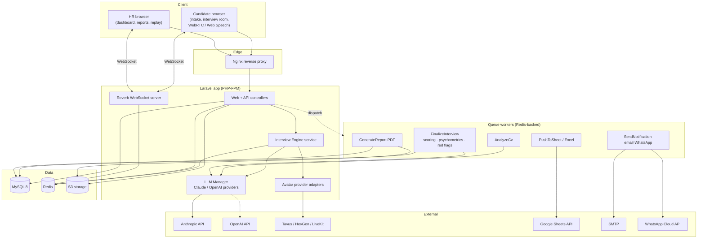
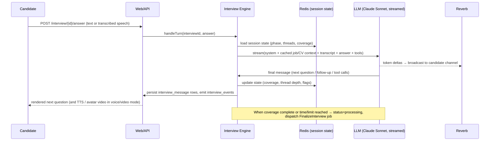
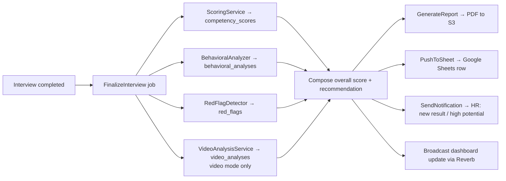
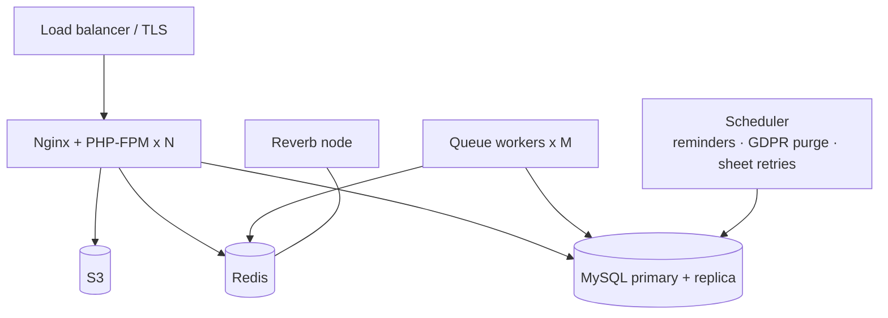

# 02 — System Architecture

## Tech stack & rationale

| Layer | Choice | Why |
|---|---|---|
| Backend framework | **Laravel 11 (PHP 8.3)** | Mature queue/broadcasting/ORM, fits the requested stack, fast to build the full surface |
| Frontend | **Blade + TailwindCSS + Alpine.js** | Server-rendered, light client state; SaaS-grade UI without an SPA build burden |
| DB | **MySQL 8** | Relational integrity for pipelines/scores; JSON columns for flexible AI payloads |
| Cache / Queue / State | **Redis** | Async AI jobs, rate limiting, live interview session state, broadcasting backplane |
| Real-time | **Laravel Reverb** | First-party WebSocket server; powers the live interview stream + HR live updates |
| Object storage | **S3-compatible** | CVs, recordings, generated PDFs |
| LLM reasoning | **Claude** (`claude-opus-4-8`, `claude-sonnet-4-6`) via `anthropic-ai/sdk`; OpenAI pluggable | Strong reasoning, vision for CV PDFs, prompt caching, tool use, streaming |
| Voice | Web Speech API (baseline) → Deepgram/ElevenLabs adapters | Zero-cost baseline that runs in-browser; upgrade path without rearchitecting |
| Video avatar | Tavus / HeyGen / OpenAI Realtime + LiveKit (adapters) | Best-in-class interactive avatars; abstracted behind a provider interface |
| PDF | `barryvdh/laravel-dompdf` | Blade-to-PDF, no headless browser needed |
| Sheets | `google/apiclient` | Official Sheets v4 client |
| Containerization | Docker + Nginx + PHP-FPM | Reproducible deploy; matches requested stack |

## Why two Claude models

The interview has two very different LLM workloads:

| Workload | Latency need | Model (default) | Notes |
|---|---|---|---|
| **Real-time conversation turns** | Low (candidate is waiting) | `claude-sonnet-4-6` | Streamed, snappy; strong enough to run an adaptive interview |
| **Deep final analysis** (scoring, psychometrics, red flags, report) | Batch (async job) | `claude-opus-4-8` | Highest reasoning quality; runs in the queue, latency irrelevant |

Both are configurable in `config/watad.php`; set both to `claude-opus-4-8` if you prefer maximum
quality for live turns and can accept higher latency. Model IDs are never hard-coded in business
logic — they flow from config through the `LlmManager`. See
[`docs/06-ai-prompt-engineering.md`](06-ai-prompt-engineering.md).

## Component diagram

## Real-time interview sequence

## Async finalization pipeline

## Deployment topology

See [`docs/18-deployment.md`](18-deployment.md) for the Docker/Nginx specifics and
[`docs/13-security-architecture.md`](13-security-architecture.md) for trust boundaries.
