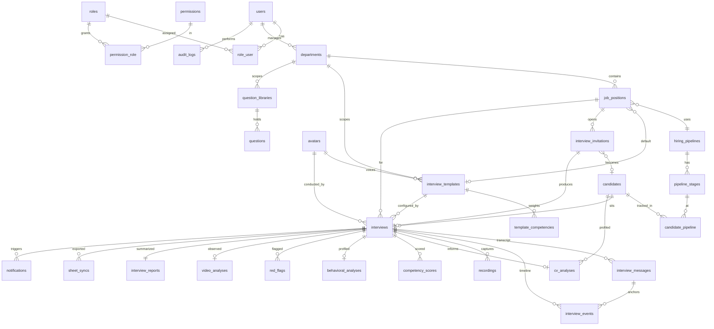

# 04 — Entity Relationship Diagram

## Cardinality notes

- A **candidate** can have multiple **interviews** (re-screens, different positions), but each
  interview belongs to exactly one job position.
- **competency_scores**, **red_flags**, **recordings**, **interview_messages**,
  **interview_events** are 1‑to‑many off `interviews`.
- **interview_reports**, **behavioral_analyses**, **video_analyses** are 1‑to‑1(0) off
  `interviews` (one finalized artifact each).
- **cv_analyses** is keyed on `candidate_id` and optionally linked to the `interview` that used it.
- RBAC is many-to-many: `users` ↔ `roles` ↔ `permissions`.

See [`docs/03-database-schema.md`](03-database-schema.md) for full column definitions.
