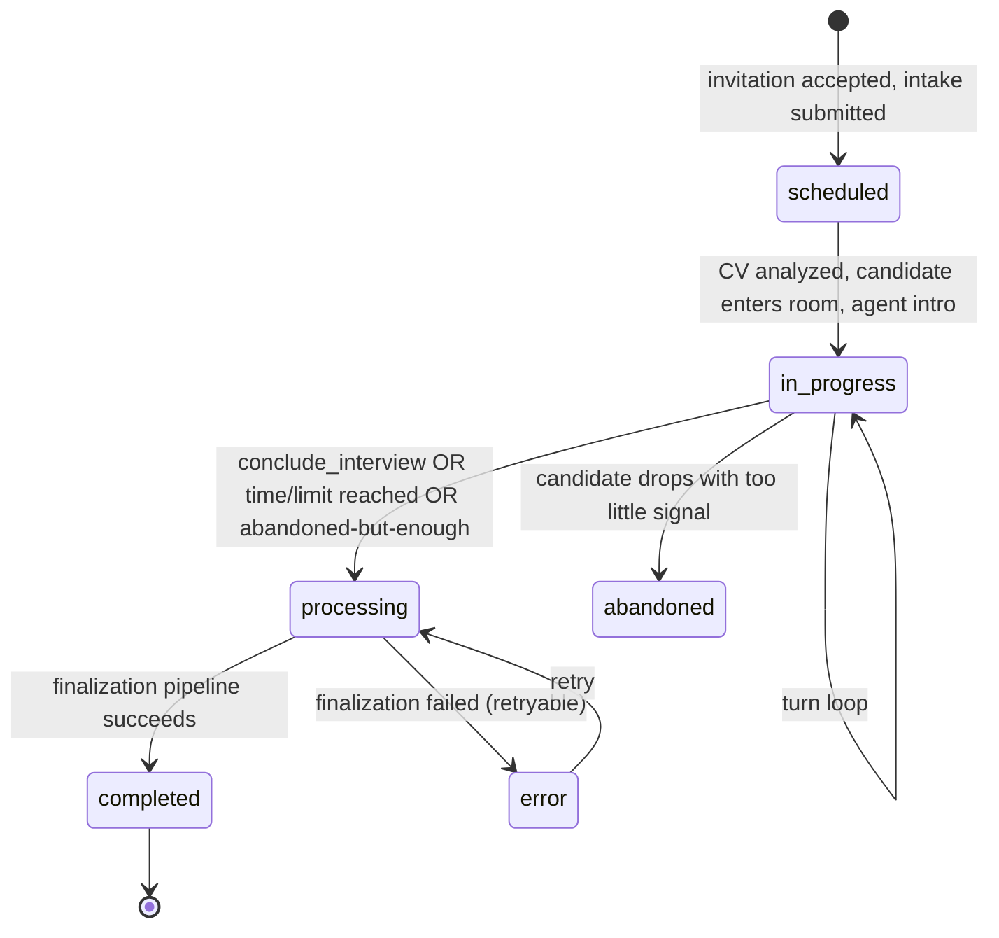
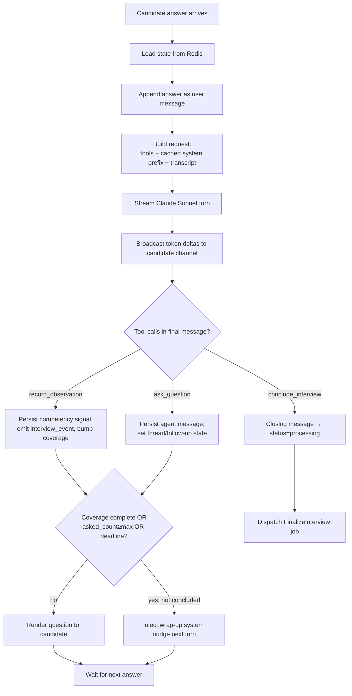

# 07 — Interview Engine Logic

The engine is a server-side state machine that drives the LLM interviewer turn-by-turn. It owns
coverage tracking, adaptive branching, follow-up depth limits, time/length budgets, and the
hand-off to the async finalization pipeline.

## Interview lifecycle (status machine)



## Per-turn state (Redis + `interviews.state`)

```jsonc
{
  "phase": "intro | core | probing | wrap_up",
  "asked_count": 7,
  "competency_coverage": {            // 0..1 coverage confidence per competency
    "technical": 0.8, "communication": 0.6, "leadership": 0.3, ...
  },
  "threads": [                        // open follow-up threads
    {"thread_key": "team_mgmt", "depth": 2, "open": true}
  ],
  "observations": 12,
  "pending_red_flags": ["salary_mismatch"],
  "started_at": 1750000000,
  "deadline_at": 1750001500          // started_at + max_duration_min
}
```

Live state lives in Redis (`interview:{id}:state`) for fast turn handling and is snapshotted to
`interviews.state` for durability/audit.

## The real-time turn loop



### Turn algorithm (pseudocode — mirrors `InterviewEngine::handleTurn`)

```
function handleTurn(interview, candidateText):
    state = redis.load(interview)
    persist candidate message (seq++, role=candidate, ms_offset=now-started_at)

    request = {
      model: config.ai.models.conversation,           // claude-sonnet-4-6
      thinking: { type: "adaptive", display: "omitted" },
      tools: INTERVIEWER_TOOLS,
      system: [
        { text: personaPrompt(interview) },
        { text: jobContext(interview) },
        { text: cvContext(interview), cache_control: { type: "ephemeral" } }   // breakpoint
      ],
      messages: transcript(interview)                  // grows after the breakpoint
    }
    if nearBudget(state): append {role:"system", text:"Begin wrapping up; ask at most one more question."}

    stream = llm.stream(request)                        // deltas broadcast to candidate channel
    final  = stream.finalMessage()
    recordTokenUsage(interview, final.usage)

    for block in final.content where type == tool_use:
        switch block.name:
          record_observation: applyObservation(state, block.input)   // coverage++, event, maybe red flag
          ask_question:       nextQuestion = block.input             // persisted as agent message
          conclude_interview: return conclude(interview, block.input.closing_message)

    state.asked_count += (nextQuestion ? 1 : 0)
    redis.save(interview, state); snapshot to interviews.state

    if coverageComplete(state) or state.asked_count >= template.max_questions or pastDeadline(state):
        if not nextQuestion: return conclude(interview, defaultClosing())
        markWrapUp(state)

    persist agent message(nextQuestion); broadcast; return nextQuestion
```

## Adaptive branching — worked example

Candidate: *"I managed a team of 10 developers."*

The model (guided by the system prompt) opens a `team_mgmt` thread and probes, one question per
turn, until it has signal or hits `follow_up_depth`:

1. "How was the team structured — squads, leads, ICs?" → `record_observation(leadership, ...)`
2. "What KPIs did you own, and how did the team track against them last quarter?"
3. "Tell me about a specific conflict on the team and exactly what you did."
4. "Walk me through a hiring decision you made and why." (depth limit → close thread)

If an answer contradicts the CV (CV says "individual contributor", answer claims "managed 10"),
the model calls `record_observation(..., possible_red_flag: "inconsistent_answer")` and probes once
to give the candidate a fair chance to reconcile, then logs the flag for finalization.

## Coverage & termination

- **Coverage**: each enabled competency accrues coverage from `record_observation` signals
  (strong/adequate = larger increment than weak; multiple angles required for high coverage). The
  interview is "covered" when every enabled competency ≥ `coverage_target` (default 0.7).
- **Termination** (whichever first):
  1. Model calls `conclude_interview`.
  2. `asked_count ≥ template.max_questions`.
  3. Wall-clock past `deadline_at` (`max_duration_min`).
  4. Coverage complete **and** `asked_count ≥ template.min_questions`.
- **Abandonment**: if the candidate disconnects, a grace timer (`config.watad.interview.abandon_grace_sec`)
  lets them rejoin (state is in Redis). On expiry: if `asked_count ≥ min_questions`, finalize with a
  partial flag; else mark `abandoned`.

## Modes (text / voice / video)

The engine is **mode-agnostic** — it always works on text turns. Modes differ only at the I/O edge:

| Mode | Candidate input | Agent output |
|---|---|---|
| `text` | Typed text | Rendered text (streamed) |
| `voice` | Browser STT (Web Speech) → text; per-turn audio saved to `recordings`/`interview_messages.audio_path` | Text → TTS (Web Speech / ElevenLabs); streamed |
| `video` | STT from the live A/V track (LiveKit); video recorded | Avatar speaks the agent text (Tavus/HeyGen); lip-synced |

Video/voice add capture + a provider adapter; the **questioning logic is identical**. See
[`docs/09-video-interview-architecture.md`](09-video-interview-architecture.md).

## Finalization hand-off

On termination the engine sets `status=processing` and dispatches `FinalizeInterview`, which fans
out to scoring, behavioral, red-flag, and (video mode) video-analysis agents, then composes the
overall score + recommendation, generates the PDF, pushes to Sheets/Excel, and notifies HR. See
[`docs/08-scoring-and-analysis.md`](08-scoring-and-analysis.md).

## Resilience

- **LLM error / refusal mid-interview**: the engine retries once with backoff; on repeat failure it
  shows the candidate a graceful "one moment" and asks a safe fallback question from the seeded
  bank, logging the incident.
- **Idempotency**: each candidate answer carries a client token; re-submits are de-duplicated by
  `(interview_id, client_token)` so a double-send never double-advances the transcript.
- **Token budget guard**: if cumulative tokens exceed `config.watad.interview.max_tokens_per_interview`,
  the engine forces wrap-up to bound cost.
