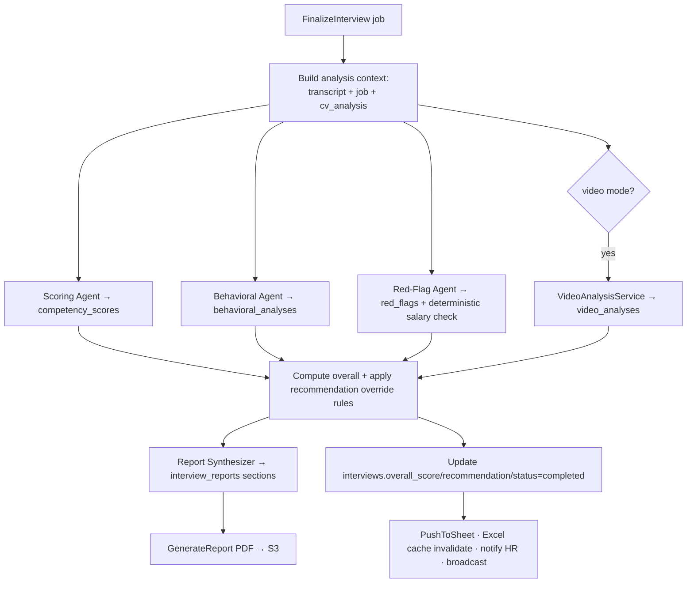

# 08 — Scoring, Behavioral & Red-Flag Analysis

Runs in the async `FinalizeInterview` pipeline on `claude-opus-4-8` with structured outputs.

## Competencies & weights

Eleven competencies, each scored 0–100. Default weights (overridable per template via
`template_competencies`):

| Competency | Key | Default weight |
|---|---|---|
| Technical skills | `technical` | 18 |
| Communication | `communication` | 12 |
| Problem solving | `problem_solving` | 12 |
| Critical thinking | `critical_thinking` | 10 |
| Confidence | `confidence` | 8 |
| Leadership potential | `leadership` | 8 |
| Culture fit | `culture_fit` | 8 |
| Professionalism | `professionalism` | 8 |
| AI knowledge | `ai_knowledge` | 6 |
| English fluency | `english_fluency` | 6 |
| Learning ability | `learning_ability` | 4 |

> For non-technical roles, lower `technical`/`ai_knowledge` weights in the template; the engine
> normalizes weights at scoring time, so they need not sum to 100.

## Overall score

```
overall = Σ (score_c × weight_c) / Σ weight_c          # over ENABLED competencies only
```

Stored on `interviews.overall_score` and `interview_reports.overall_score`. Each competency row
also stores `confidence` (model self-rating) and `evidence` (transcript `seq` refs).

## Recommendation mapping (default thresholds)

| Overall | Recommendation | Override rules |
|---|---|---|
| ≥ 82 | `strong_hire` | Downgraded to `hire` if any **high** red flag |
| 68–81 | `hire` | Downgraded to `maybe` if ≥ 2 medium red flags |
| 50–67 | `maybe` | — |
| < 50 | `reject` | — |
| any | `reject` | If a **high** red flag of type `fake_experience` or `inconsistent_answer` is confirmed and unmitigated |

Thresholds and override rules live in `config/watad.php → scoring`. The Report Synthesizer may
adjust within one band with a written justification; the override rules are enforced in code, not
left to the model.

## Calibration guidance (in the scoring prompt)

- `50` = meets the bar for the role's **seniority** (not an absolute scale).
- `80+` = clearly above bar with concrete, owned evidence.
- `<40` = below bar.
- Unsupported claims do not earn points; concrete, specific, owned examples do.
- Every score must cite `evidence_seqs`; the service rejects and retries a score lacking evidence.

## Psychological / behavioral analysis

Produced by the Behavioral Agent → `behavioral_analyses`:

| Output | Field | Notes |
|---|---|---|
| Personality type | `personality_type` | Short label, e.g. "Analytical-Driver" |
| DISC approximation | `disc` | `{D,I,S,C}` 0–100 |
| Big-Five approximation | `big_five` | OCEAN 0–100 |
| Leadership tendencies | `leadership_tendency` | Narrative |
| Growth-mindset score | `growth_mindset_score` | 0–100 |
| Stress-handling score | `stress_handling_score` | 0–100 |
| Risk indicators | `risk_indicators` | `[{label, severity, note}]` |
| Integrity indicators | `integrity_indicators` | `[{label, note}]` |

> Explicitly framed as **interview-based approximations**, not clinical/psychometric instruments.
> Used as supporting context for human decision-makers, never as a sole basis for rejection.

## Red-flag detection

Produced by the Red-Flag Agent → `red_flags`. Types: `inconsistent_answer`, `suspicious_claim`,
`salary_mismatch`, `fake_experience`, `lack_of_ownership`, `poor_communication`,
`aggressive_behavior`, `evasive_answer`. Each carries `severity` and `evidence` (quotes + seq).

- **Salary mismatch** is computed deterministically too: if `expected_salary` is outside
  `[salary_min × (1−tol), salary_max × (1+tol)]` (tol from config), a `salary_mismatch` flag is
  raised regardless of the model, with the numbers attached.
- "No red flags" is a normal, common result — the agent is instructed not to fabricate.

## Confidence measurement

Confidence is tracked two ways and reconciled:
1. **Live signals** — `record_observation.confidence_delta` (up/down/flat) during the interview,
   emitted as `interview_events` (e.g., "02:11 candidate confidence increased").
2. **Final score** — the `confidence` competency scored from the full transcript.
   In video mode, the video `confidence_score` is blended (configurable weight) into the narrative.

## Pipeline orchestration



Each agent call is retried with backoff; a hard failure marks `interviews.status = error` and
alerts ops without losing the transcript (idempotent re-run is safe).
