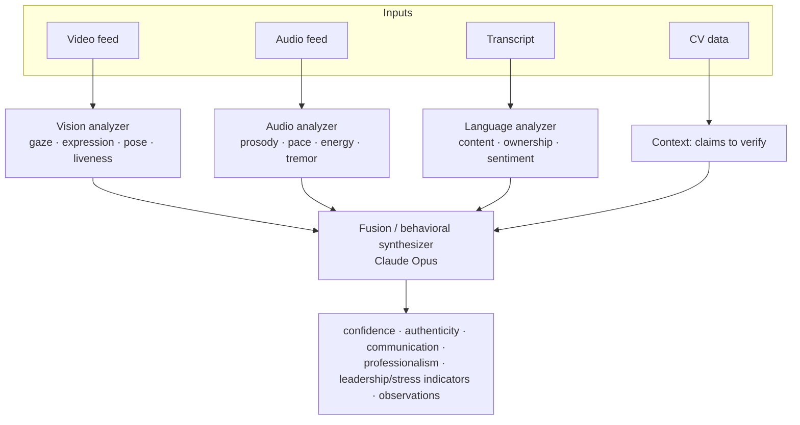

# 10 — Video & Behavioral Analysis Engine

Analyzes the candidate's video/audio stream to produce engagement and demeanor signals that
augment (never replace) the transcript-based scores. Results land in `video_analyses` and a
timeline used by the replay dashboard.

> **Build status.** Specified and abstracted behind `VideoAnalysisService`; the heavy CV/ML
> inference runs on a separate worker (or a managed vision API) and reports back via
> `POST /api/webhooks/video-analysis`. Not exercisable in a bare checkout (needs GPU/vision infra).

## Signals & storage (`video_analyses`)

| Signal | Column | Method |
|---|---|---|
| Eye contact | `eye_contact_score` | Gaze estimation vs. camera; % on-camera |
| Facial expressions | `facial_expression` (JSON dist.) | Expression classifier over frames |
| Engagement | `engagement_score` | Composite of gaze, expression, responsiveness |
| Confidence | `confidence_score` | Voice steadiness + posture + latency to answer |
| Nervousness | `nervousness_score` | Fidget rate, gaze aversion, vocal tremor |
| Energy level | `energy_score` | Vocal energy + movement |
| Attention | `attention_score` | On-screen focus, tab-switch / focus-loss telemetry |
| Professional appearance | `professional_appearance_score` | Framing, lighting, background, attire (advisory only) |
| Speaking pace | `speaking_pace_wpm` | Words/min from STT |
| Body language | `body_language` (JSON) | Posture/gesture observations |
| Authenticity | `authenticity_score` | Liveness + lip-sync consistency (anti-deepfake / anti-proxy) |
| Timeline | `timeline` (JSON) | `[{ms_offset, signal, value}]` for replay overlay |

## Multi-agent behavioral pipeline

Four input modalities → specialized analyzers → a fusion step:



The fusion step is the Behavioral Agent (Opus): it reconciles modalities (e.g., transcript shows a
strong answer but voice shows high tremor → "confident content, nervous delivery") and writes
narrative observations + numeric blends into `behavioral_analyses` and the report's behavioral
section.

## Processing flow

```mermaid
sequenceDiagram
    participant FE as Interview room
    participant API as Laravel
    participant Q as video-analysis worker
    participant WH as webhook

    Note over FE: live telemetry (focus loss, mic level) → /event (lightweight, real-time)
    API->>API: on finalize (video mode), enqueue analysis with recording ref
    API->>Q: job: analyze(recording_url, transcript)
    Q->>Q: sample frames · run vision/audio models · align to transcript ms_offsets
    Q->>WH: POST results (HMAC-signed)
    WH->>API: persist video_analyses + timeline; blend into report
```

## Fairness & ethics guardrails

- Video signals are **advisory** and weighted low in the overall score (configurable; default the
  overall score is transcript-driven, with video used for the behavioral narrative + flags).
- No inference of protected characteristics. "Professional appearance" is advisory context for HR,
  not a scored gate, and is clearly labeled as such.
- Candidates consent to recording at intake; video mode can be declined → falls back to voice/text.
- Liveness/authenticity exists to catch **impersonation/deepfake proxies**, not to judge identity.

## Modes without video

In text/voice mode, `video_analyses` is skipped; confidence/engagement come purely from transcript
and (voice mode) audio prosody if a voice provider with analysis is configured.
