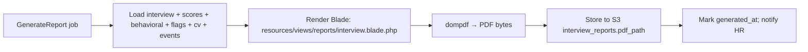

# 12 — PDF Report Structure

Generated by `PdfReportService` (Blade → `barryvdh/laravel-dompdf`) in the `GenerateReport` job,
stored in S3 (`interview_reports.pdf_path`), downloadable via a signed URL. RTL-aware (Arabic
reports render right-to-left with the Cairo font).

## Cover / header

- Watad logo + "AI Interview Report"
- Candidate name · Position · Department · Date
- **Overall score** (large, color-coded) + **Recommendation** badge
  (Strong Hire = green, Hire = teal, Maybe = amber, Reject = red)
- Interview metadata: mode, duration, question count, avatar/interviewer, language

## Sections (in order)

| # | Section | Content / source |
|---|---|---|
| 1 | **Candidate Information** | Name, email, phone, LinkedIn, country, experience, expected salary, notice period |
| 2 | **Resume Summary** | `interview_reports.resume_summary` + `cv_analyses` highlights, JD-match score |
| 3 | **Interview Summary** | `interview_reports.interview_summary` (narrative of how it went) |
| 4 | **Strengths** | `interview_reports.strengths[]` bullets |
| 5 | **Weaknesses** | `interview_reports.weaknesses[]` bullets |
| 6 | **Technical Assessment** | `technical_assessment` + technical/ai_knowledge/problem_solving scores |
| 7 | **Behavioral Assessment** | `behavioral_assessment` + DISC & Big-Five charts + growth/stress scores |
| 8 | **AI Analysis** | `ai_analysis` — confidence trajectory, communication, notable moments |
| 9 | **Red Flags** | `red_flags[]` table (type · severity · description · evidence). "None detected" if empty |
| 10 | **Hiring Recommendation** | `hiring_recommendation` narrative + final badge + score breakdown table |

## Visual elements

- **Competency bar chart** — all enabled competencies with score bars + weight labels.
- **DISC / Big-Five** — horizontal bars (rendered as styled divs; no JS/headless browser needed).
- **Score breakdown table** — competency · score · weight · weighted contribution.
- **Moment timeline** — selected `interview_events` (e.g., "05:22 strong technical answer",
  "08:14 possible inconsistency") as a compact vertical list with timestamps.
- **Footer** — generated-at, model version, page numbers, and a confidentiality notice; a watermark
  ("AI-assisted screening — for internal hiring use") on every page.

## Layout

- A4, ~18mm margins, Tailwind-like utility CSS compiled to inline styles for dompdf.
- Fonts: Inter (LTR) / Cairo (RTL, Arabic). Bundled under `resources/fonts`.
- Page breaks before Red Flags and Hiring Recommendation so they're never split.

## Generation flow

## Access & security

- Served only via time-limited **signed URLs**; never a public S3 object.
- Every download writes an `audit_logs` entry (`action=viewed`/`exported`, target = interview).
- Reports for soft-deleted/erased candidates are purged with their S3 objects (GDPR).

The Blade template (`resources/views/reports/interview.blade.php`) and service
(`app/Services/Reports/PdfReportService.php`) implement this structure; a scaffold is included.
