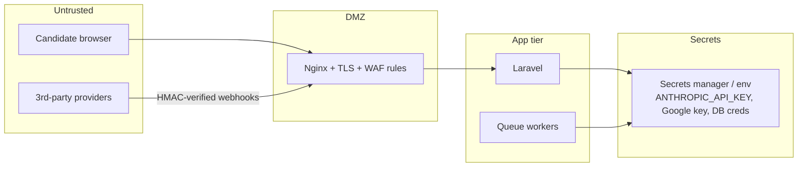

# 13 — Security Architecture

## Trust boundaries

The candidate is **never** trusted: their session has only a short-lived, signed interview token
scoped to one `interviews.public_id`, and cannot reach HR data.

## AuthN / AuthZ

- HR: Laravel session auth, password hashing (bcrypt/argon2), optional **TOTP 2FA**
  (`two_factor_secret`), login throttling + lockout.
- API: **Sanctum** bearer tokens with abilities; token rotation supported.
- Candidate: signed URL / token bound to interview, single-purpose, expiring (`expires_at`).
- **RBAC** enforced via `EnsureRole`/`can:` middleware + policies on every controller action; see
  [`docs/14-rbac.md`](14-rbac.md). Default-deny.

## Session management

- Encrypted, `HttpOnly`, `Secure`, `SameSite=Lax` cookies; Redis-backed sessions.
- Idle + absolute session lifetimes; "log out other devices"; session list per user.
- Re-auth required for sensitive actions (user management, GDPR erasure, integration secrets).

## API security

- All endpoints behind HTTPS/HSTS; TLS terminated at Nginx.
- Input validation via Form Requests; mass-assignment guarded (`$fillable`).
- Output encoding in Blade; CSP, `X-Frame-Options=DENY`, `X-Content-Type-Options=nosniff`,
  Referrer-Policy headers via middleware.
- CSRF on all stateful web routes; API uses bearer tokens (no cookie CSRF surface).
- **Webhooks**: provider HMAC signature verification + IP allowlist; replay protection via
  timestamp + nonce; unverified → 401 + audited.
- SQL injection: Eloquent/parameter binding only; no raw interpolation.
- File uploads (CV): type + size validation, stored in private S3 (never web root), filenames
  randomized, served via signed URLs; AV scan hook (`config.watad.uploads.av_scan`).

## Rate limiting & abuse

| Surface | Limit | Backed by |
|---|---|---|
| Login | 5/min/IP + lockout | Redis |
| Candidate answer | 30/min/token | Redis |
| HR API | 120/min/user | Redis |
| Webhooks | IP allowlist + 600/min | Redis |
| LLM spend | per-interview token cap (`max_tokens_per_interview`) | engine guard |

## Secrets

- No secrets in code or repo. All via env / secrets manager.
- `ANTHROPIC_API_KEY`, OpenAI key, Google service-account JSON, provider keys, DB/Redis creds
  injected at runtime; rotated periodically.
- LLM provider keys are server-side only; never shipped to the browser.

## Audit logging

- `audit_logs` records actor, action, target (polymorphic), before/after diff, IP, user agent, time.
- Logged actions: login/logout, CRUD on jobs/candidates/users/templates, report views & exports,
  stage moves, integration changes, **GDPR erasure**.
- Tamper-evidence: append-only table; periodic export to immutable storage (WORM bucket) optional.

## GDPR / data protection

- **Lawful basis & consent**: candidate consents to processing + recording at intake
  (`candidates.consent_at`); consent text versioned.
- **Data minimization**: only fields needed for screening are collected.
- **Right to access**: candidate data export endpoint (admin-initiated).
- **Right to erasure**: `GdprEraseCandidate` cascades delete across interviews, messages,
  recordings, analyses; removes S3 objects (CV, recordings, report PDF); writes `audit_logs`
  (`action=gdpr_erase`).
- **Retention**: `PurgeExpiredCandidateData` scheduled job hard-deletes data older than
  `config.watad.gdpr.retention_days` (default 365) and purges S3.
- **Encryption**: TLS in transit; at-rest encryption for DB volumes, Redis (where supported), and
  S3 (SSE). Sensitive columns (`two_factor_secret`) encrypted via Laravel encrypted casts.
- **Data residency**: S3 bucket + DB region pinned per deployment policy.
- **Bias & fairness controls**: prompts forbid protected-characteristic questions; scores must cite
  transcript evidence; video "appearance" signals are advisory and labeled; periodic adverse-impact
  audits recommended (compare recommendation rates across cohorts where lawful to measure).

## Dependency & supply chain

- `composer audit` / `npm audit` in CI; pinned versions; Dependabot.
- Container images built from pinned base images; non-root app user; read-only rootfs where possible.

## Incident readiness

- Structured logs (no PII in logs); centralized log shipping.
- Health checks, error alerting on `interviews.status=error` and failed jobs.
- Backups: nightly MySQL dumps + S3 versioning; documented restore runbook.
