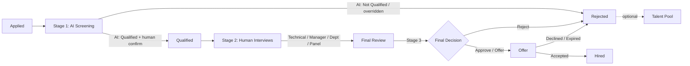

# 20 — System Blueprint & Sitemap

The platform has **two front doors** sharing one backend/database:

1. **Admin Panel** (HR/hiring team) — `auth` guard (`users`).
2. **Candidate Portal** (applicants) — `candidate` guard (`candidate_users`).

```
Watad AI Hiring Platform
│
├── ADMIN PANEL  (/hr/*)                         guard: web (users)
│   ├── 1. Dashboard                 /hr
│   ├── 2. Candidates                /hr/candidates           → /hr/candidates/{id} (Master Profile)
│   ├── 3. Jobs                      /hr/jobs                 → /hr/jobs/{id}
│   ├── 4. AI Interviews             /hr/ai-interviews        → /hr/ai-interviews/{id} (replay)
│   ├── 5. Human Interviews          /hr/interviews           → schedule / evaluate
│   ├── 6. Hiring Pipeline (Kanban)  /hr/pipeline
│   ├── 7. Departments               /hr/departments
│   ├── 8. Team Members              /hr/users
│   ├── 9. Reports & Analytics       /hr/reports
│   ├── 10. AI Configuration         /hr/ai-config
│   ├── 11. Audit Logs               /hr/audit
│   ├── 12. System Settings          /hr/settings
│   └── Roles & Permissions          /hr/roles
│       Talent Pool                  /hr/talent-pool
│       Offers                       /hr/offers
│       Question Bank                /hr/questions
│       Interview Templates          /hr/templates
│       Avatars                      /hr/avatars
│
└── CANDIDATE PORTAL  (/portal/*)                guard: candidate (candidate_users)
    ├── 1. Dashboard                 /portal
    ├── 2. My Applications           /portal/applications     → /portal/applications/{id}
    ├── 3. Interviews                /portal/interviews       → /portal/interviews/{id} (AI room / instructions)
    ├── 4. Profile                   /portal/profile
    ├── 5. Notifications             /portal/notifications
    └── 6. Offers                    /portal/offers           → /portal/offers/{id} (review / e-sign)

PUBLIC
    ├── Job board / apply            /jobs , /jobs/{slug}/apply
    ├── Invitation link              /i/{token}
    └── Candidate auth               /portal/login , /portal/register , /portal/verify
```

## The 3-stage hiring flow (at a glance)



> **The AI never makes the final call.** Stage 1 produces a recommendation
> (`qualified` / `not_qualified`) + scores + report; an authorized user advances or **overrides**
> it (logged as a `hiring_decision` with `ai_overridden = true`). See
> [`docs/21-hiring-workflow.md`](21-hiring-workflow.md).

## Modules (each has its own permissions — see [`docs/25`](25-permissions-matrix.md))

| Module | Admin tab | Backing tables (new in v2 in **bold**) |
|---|---|---|
| Dashboard | 1 | (aggregates) |
| Candidates / Master Profile | 2 | `candidates`, **`candidate_documents`**, **`candidate_notes`**, **`candidate_activities`**, **`tags`** |
| Jobs | 3 | `job_positions`, **`job_applications`** |
| AI Interviews | 4 | `interviews`, `interview_messages`, `recordings`, `competency_scores`, `interview_reports` |
| Human Interviews | 5 | **`human_interviews`**, **`interview_panelists`**, **`interview_evaluations`** |
| Pipeline | 6 | `pipeline_stages`, **`job_applications`**, **`application_activities`** |
| Departments | 7 | `departments` |
| Team Members | 8 | `users`, `roles`, `permissions` |
| Reports | 9 | (aggregates) |
| AI Configuration | 10 | `avatars`, `interview_templates`, `template_competencies`, **`ai_settings`** |
| Audit Logs | 11 | `audit_logs` |
| System Settings | 12 | **`settings`**, **`message_templates`**, **`user_integrations`** |
| Roles & Permissions | — | `roles`, `permissions` |
| Talent Pool | — | **`talent_pools`**, **`talent_pool_candidate`** |
| Offers | — | **`offers`** |
| Evaluation Templates | (in Jobs/AI cfg) | **`evaluation_templates`**, **`evaluation_criteria`** |
| Candidate Portal | (portal) | **`candidate_users`**, `job_applications`, `notifications`, **`offers`** |

## Global status vocabulary

| Domain | Statuses |
|---|---|
| **Application** (`job_applications.status`) | `applied` · `ai_screening` · `qualified` · `disqualified` · `tech_interview` · `manager_interview` · `final_review` · `offer` · `hired` · `rejected` · `withdrawn` |
| **AI interview** (`interviews.status`) | `scheduled` · `in_progress` · `processing` · `completed` · `abandoned` · `error` |
| **AI recommendation** | `strong_hire` · `hire` · `maybe` · `reject` → surfaced to HR as **Qualified / Not Qualified** |
| **Human interview** (`human_interviews.status`) | `scheduled` · `in_progress` · `completed` · `cancelled` · `no_show` · `rescheduled` |
| **Hiring decision** (`hiring_decisions.decision`) | `advance` · `hold` · `reject` · `approve` · `make_offer` |
| **Offer** (`offers.status`) | `draft` · `sent` · `viewed` · `accepted` · `declined` · `expired` · `withdrawn` |

Pipeline stages (Kanban, configurable per `hiring_pipelines`): **Applied → AI Screening → Qualified
→ Technical Interview → Manager Interview → Final Review → Offer → Hired / Rejected**.

Cross-references: tabs → [`docs/23`](23-admin-tabs.md) & [`docs/24`](24-candidate-portal.md);
schema → [`docs/26`](26-schema-v2.md); API → [`docs/27`](27-api-v2.md); roadmap →
[`docs/28-modules-and-roadmap.md`](28-modules-and-roadmap.md).
