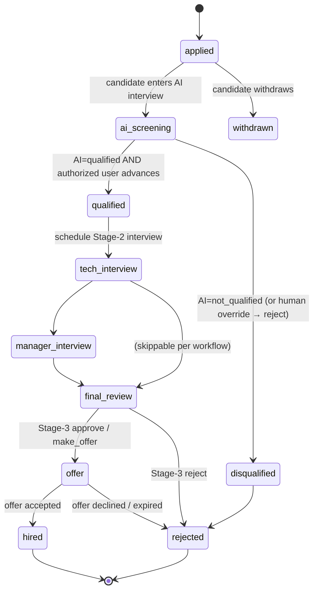
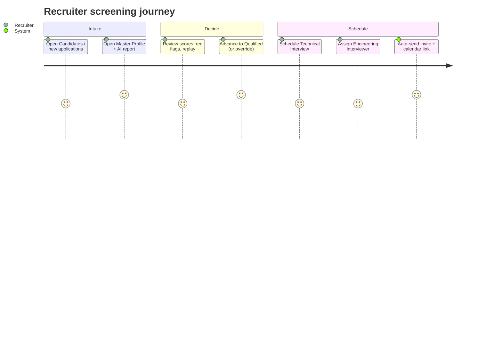
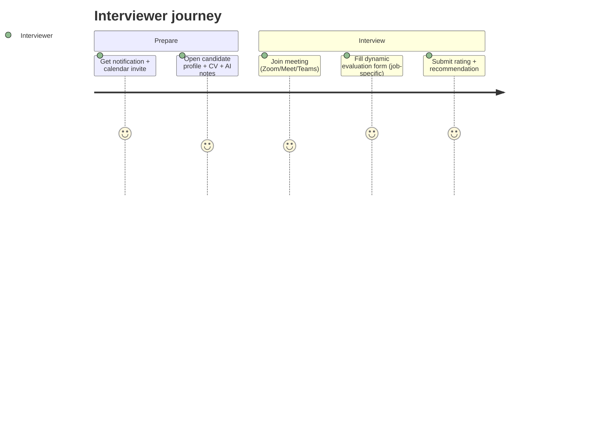
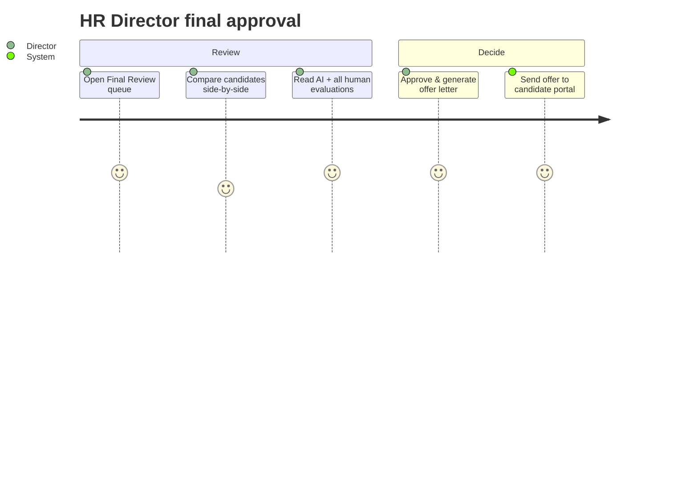
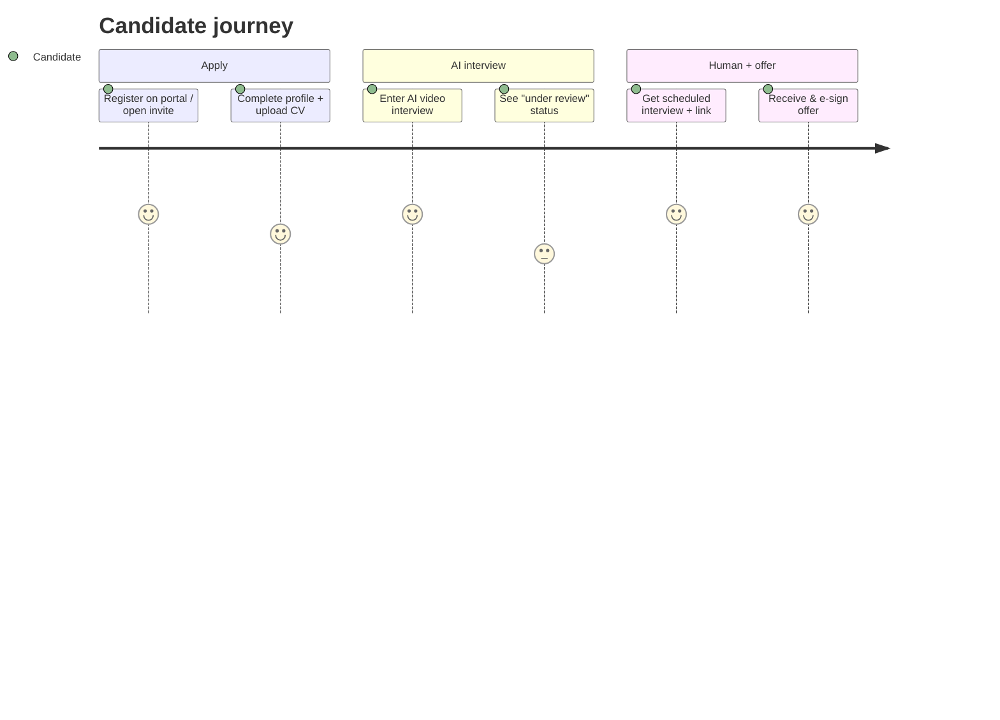

# 21 — Organizational Hiring Workflow (3 Stages)

The spine of the platform is the **`job_applications`** record (one per candidate per job). Every
stage reads/writes it; every transition is logged in **`application_activities`** and gated by a
**`hiring_decisions`** row when a human acts.



---

## Stage 1 — AI Screening Interview

**Trigger:** candidate applies (`job_applications` created, status `applied`) → starts the AI
interview (existing engine) → status `ai_screening`.

**AI analyzes** (multi-agent, see [`docs/06`](06-ai-prompt-engineering.md)/[`docs/08`](08-scoring-and-analysis.md)):
CV · video · voice · transcript · behavioral · technical · communication · AI literacy ·
leadership potential · culture fit.

**AI produces** (stored on the AI `interviews` + analysis tables): detailed report, competency
scores, overall score, and a recommendation → mapped to **Qualified / Not Qualified** for HR:

| Overall / recommendation | Surfaced to HR |
|---|---|
| `strong_hire`, `hire` | **Qualified** ✅ |
| `maybe` | **Borderline** (needs review) |
| `reject` | **Not Qualified** ❌ |

**Decision (human, required):** an authorized user (`decisions.advance` / `decisions.reject` /
`decisions.override_ai`) reviews the report and:
- **Advance** → status `qualified` (records `hiring_decision{decision: advance, stage: ai_screening}`).
- **Reject** → status `disqualified` → `rejected`.
- **Override**: advance a `not_qualified` candidate, or reject a `qualified` one → the
  `hiring_decision` is stored with `ai_overridden = true` + a mandatory `reason`. The AI output is
  never deleted; the override sits beside it on the timeline.

> **Rule enforced in code:** the AI cannot move an application past `ai_screening`. Only a
> `hiring_decision` by a permitted user changes the status. A config toggle
> (`ai_config.auto_advance_strong_hire`) may *propose* advancing, but still records the acting user.

---

## Stage 2 — Human Interview Stage

An authorized user (`human_interviews.create` / `interviews.schedule`) schedules one or more
interviews against the application:

| Field | Values |
|---|---|
| `type` | `technical` · `manager` · `department` · `panel` |
| `mode` | `onsite` · `online` |
| `meeting_provider` | `zoom` · `google_meet` · `ms_teams` · `onsite` |
| `meeting_url` | auto-generated via integration, or manual |
| `scheduled_at`, `duration_min`, `timezone` | — |
| panelists | one (single) or many (`panel`) — any department, **not only HR** |

Interviewers can belong to **HR, Engineering, Sales, Operations, Product, or Management** — assigned
via `interview_panelists` (a `users` row). Status moves `qualified → tech_interview →
manager_interview → final_review` as interviews complete.

**Evaluation (dynamic form):** after the interview each panelist submits an evaluation. The form is
**generated from the Job Position** via an `evaluation_template` (resolved by precedence: job → job's
department → interview type → global default). Fields:

```
interview_evaluations: overall_rating (1-5), recommendation (strong_yes|yes|neutral|no|strong_no),
                       strengths[], weaknesses[], notes, criteria_scores{criterion_id: value}
evaluation_templates → evaluation_criteria: { label, type(rating|scale|boolean|select|text),
                       weight, options[], required }
```

The interview is `completed` once all required panelists submit (or the organizer closes it).
Aggregated panel score = weighted mean of criteria across submitted evaluations.

---

## Stage 3 — Final Approval

Once interviews are done (status `final_review`), an authorized user (`decisions.approve` /
`decisions.make_offer` / `decisions.reject`) chooses:

| Option | Effect |
|---|---|
| **Final Onsite Interview** | schedule another `human_interview` (mode onsite) before deciding |
| **Final Online Interview** | schedule another online `human_interview` |
| **Direct Approval / Make Offer** | status → `offer`; create an `offers` record (Offer Letter Generator) |
| **Rejection** | status → `rejected` (with reason) |

Offer flow: `offers` → letter generated (PDF) → sent to candidate portal → candidate
**reviews & e-signs** → `accepted` → application `hired`; or `declined`/`expired` → `rejected`.
Rejected candidates can be moved to the **Talent Pool** for future roles.

---

## User journeys

### Recruiter — screen & advance


### Technical Interviewer (Engineering) — evaluate


### HR Director — final decision


### Candidate — apply → interview → offer


## Notifications fired per transition (see `message_templates`)

| Transition | Candidate | HR/Team |
|---|---|---|
| Application received | "Application received" | "New candidate" |
| AI interview ready | invite + link | — |
| AI interview completed | "Under review" | "Interview completed" + high-potential alert |
| Advanced / Qualified | "You're moving forward" | — |
| Human interview scheduled | invite + calendar + meeting link | calendar invite to panelists |
| Reminder (T-24h, T-1h) | reminder | reminder |
| Offer made | "You have an offer" | — |
| Offer accepted | confirmation | "Candidate accepted" |
| Rejected | (configurable, kind rejection) | — |
