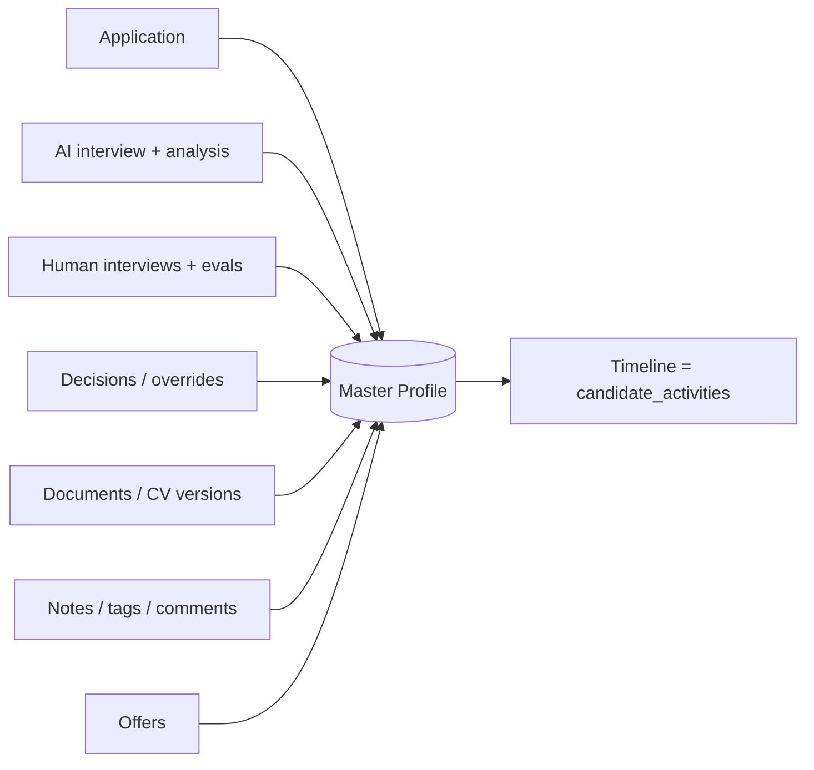

# 22 — Candidate Master Profile

A single, permanent, ever-growing record per person. It aggregates everything from every stage and
every application. Built from `candidates` + related tables; **nothing is deleted** (soft deletes +
GDPR-controlled erasure only).

## Screen layout (`/hr/candidates/{id}`)

```
┌──────────────────────────────────────────────────────────────────────────┐
│  ‹ Back   [avatar] Mona Adel              ★ Tag ▾   ⤴ Add to Talent Pool   │
│           Senior Backend Engineer · Cairo · 6y exp   [Compare] [⋯ Actions] │
│  Status: Final Review   AI: Qualified (78)   Tags: #referral #senior       │
├───────────────┬────────────────────────────────────────────────────────────┤
│ Overview      │  (tab content)                                              │
│ Applications  │                                                             │
│ AI Interviews │                                                             │
│ Human Reviews │                                                             │
│ Documents     │                                                             │
│ Notes         │                                                             │
│ Timeline      │                                                             │
│ Offers        │                                                             │
└───────────────┴────────────────────────────────────────────────────────────┘
```

## Profile sections / sub-tabs

| Sub-tab | Contents | Source tables |
|---|---|---|
| **Overview** | Personal data, contact, current status, AI summary, latest scores, key flags | `candidates`, latest `interviews`/`interview_reports` |
| **Applications** | Every job applied to, status, current stage, dates | `job_applications` |
| **AI Interviews** | Each AI session: replay (video/audio), transcript, scores, recommendation, red flags, behavioral | `interviews`, `recordings`, `interview_messages`, `competency_scores`, `behavioral_analyses`, `red_flags` |
| **Human Reviews** | Each human interview: type, panelists, ratings, recommendation, strengths/weaknesses, notes | `human_interviews`, `interview_evaluations`, `interview_panelists` |
| **Documents** | Resume **versions**, portfolio links, certificates, attachments (download, set primary) | `candidate_documents` |
| **Notes** | Internal notes & comments (threaded, pinnable, visibility internal/private) | `candidate_notes` |
| **Timeline** | Chronological activity feed across all stages and applications | `candidate_activities` |
| **Offers** | Offers made, status, letter, e-signature | `offers` |

## Data captured (full field list)

| Group | Fields |
|---|---|
| Personal | full_name, photo, date_of_birth (optional), country, city, nationality (optional, sensitive) |
| Contact | email, phone, linkedin_url, portfolio_url, website, other_links[] |
| Resume | CV versions (`candidate_documents` type=cv, `version`, `is_primary`), extracted `cv_text` |
| Professional | years_experience, current_title, current_company, expected_salary, salary_currency, notice_period |
| Skills | skills[] (from CV analysis + manual), languages[], certificates (`candidate_documents` type=certificate) |
| Interview history | all AI + human interviews with outcomes |
| Media | video & audio recordings (`recordings`) — signed URLs only |
| AI analysis | scores, behavioral profile, red flags, report PDF |
| Human reviews | evaluations, ratings, recommendations |
| Decisions | every `hiring_decision` incl. AI overrides (who, when, why) |
| Engagement | notes, internal comments, tags, talent-pool membership |
| Consent / GDPR | `consent_at`, retention status, erasure requests |
| Timeline | `candidate_activities` (polymorphic activity stream) |

## Accumulation rule

Each stage **appends**, never overwrites:
- A new application → new `job_applications` row (the candidate can apply to many jobs).
- A new CV upload → new `candidate_documents` row with incremented `version` (old versions kept).
- Each AI/human interview, evaluation, decision, note, offer → its own immutable row.
- Every meaningful event writes a `candidate_activities` entry → the **Timeline**.



## Activity timeline event types (`candidate_activities.type`)

`application_created` · `ai_interview_started` · `ai_interview_completed` · `decision_made` ·
`ai_overridden` · `stage_changed` · `human_interview_scheduled` · `human_interview_completed` ·
`evaluation_submitted` · `note_added` · `document_uploaded` · `tag_added` · `offer_sent` ·
`offer_accepted` · `offer_declined` · `email_sent` · `whatsapp_sent` · `added_to_talent_pool`.

Each carries `actor` (user or system), `payload` (JSON), and `occurred_at` — rendered as the
chronological feed in the Timeline sub-tab.

## Permissions touching the profile

`candidates.view` (open profile) · `candidates.update` · `candidates.delete` ·
`candidates.access_sensitive` (DOB/nationality/financial) · `candidates.access_financial`
(salary/offers) · `notes.create`/`notes.view` · `documents.view`/`documents.create` ·
`decisions.*` · `offers.view`. Sensitive groups are masked unless the user holds the permission.
