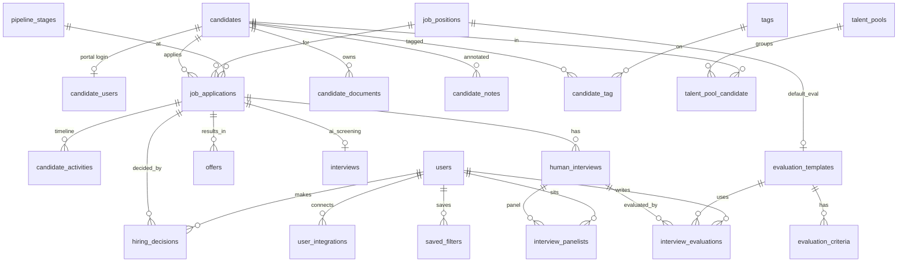

# 26 — Database Schema v2 (Multi-stage, Portal, Enterprise)

New tables that extend [`docs/03`](03-database-schema.md). MySQL 8 / InnoDB / utf8mb4. All carry
`created_at`/`updated_at` unless noted; PII tables use soft deletes. Implemented as real Laravel
migrations (`database/migrations/2024_02_01_*`).

## ERD (new tables + key links)



## Identity / portal

```sql
candidate_users (
  id, candidate_id FK→candidates, email UNIQUE, password,
  email_verified_at NULL, remember_token, last_login_at NULL,
  locale CHAR(2) DEFAULT 'en', is_active TINYINT DEFAULT 1, timestamps
)
```

## Applications & pipeline spine

```sql
job_applications (
  id, public_id CHAR(26) UNIQUE,          -- ULID
  candidate_id FK, job_position_id FK,
  stage_id FK→pipeline_stages NULL,       -- current Kanban stage
  ai_interview_id FK→interviews NULL,
  status ENUM('applied','ai_screening','qualified','disqualified','tech_interview',
              'manager_interview','final_review','offer','hired','rejected','withdrawn')
         DEFAULT 'applied',
  source VARCHAR(60) NULL, owner_id FK→users NULL,
  applied_at TIMESTAMP, last_activity_at TIMESTAMP NULL,
  timestamps, softDeletes,
  UNIQUE(candidate_id, job_position_id)
)

candidate_activities (                    -- the Master Profile timeline (also per-application)
  id, candidate_id FK, application_id FK→job_applications NULL,
  type VARCHAR(50), actor_type VARCHAR(20) DEFAULT 'user',  -- user|system|candidate
  actor_id BIGINT NULL, summary VARCHAR(255), payload JSON NULL,
  occurred_at TIMESTAMP, created_at,
  INDEX(candidate_id, occurred_at)
)
```

## Master-profile artifacts

```sql
candidate_documents (
  id, candidate_id FK, uploaded_by FK→users NULL,
  type ENUM('cv','portfolio','certificate','attachment') DEFAULT 'cv',
  label VARCHAR(190) NULL, path VARCHAR(512), original_name VARCHAR(255) NULL,
  version SMALLINT UNSIGNED DEFAULT 1, is_primary TINYINT DEFAULT 0,
  size_bytes BIGINT NULL, timestamps
)

candidate_notes (
  id, candidate_id FK, application_id FK NULL, user_id FK→users NULL,
  body TEXT, visibility ENUM('internal','private') DEFAULT 'internal',
  is_pinned TINYINT DEFAULT 0, timestamps, softDeletes
)

tags ( id, name VARCHAR(60) UNIQUE, color VARCHAR(20) NULL, timestamps )
candidate_tag ( candidate_id FK, tag_id FK, PRIMARY KEY(candidate_id, tag_id) )

talent_pools ( id, name VARCHAR(150), description VARCHAR(255) NULL, created_by FK→users NULL, timestamps )
talent_pool_candidate (
  talent_pool_id FK, candidate_id FK, added_by FK→users NULL, note VARCHAR(255) NULL,
  added_at TIMESTAMP, PRIMARY KEY(talent_pool_id, candidate_id)
)
```

## Human interviews & evaluations (Stage 2)

```sql
evaluation_templates (
  id, name VARCHAR(150), job_position_id FK NULL, department_id FK NULL,
  interview_type VARCHAR(20) NULL,        -- technical|manager|department|panel (null = any)
  is_default TINYINT DEFAULT 0, is_active TINYINT DEFAULT 1, timestamps
)
evaluation_criteria (
  id, template_id FK, label VARCHAR(190),
  type ENUM('rating','scale','boolean','select','text') DEFAULT 'rating',
  weight DECIMAL(5,2) DEFAULT 10, options JSON NULL, is_required TINYINT DEFAULT 1,
  position SMALLINT UNSIGNED DEFAULT 0
)

human_interviews (
  id, public_id CHAR(26) UNIQUE, application_id FK→job_applications,
  template_id FK→evaluation_templates NULL, organizer_id FK→users NULL,
  type ENUM('technical','manager','department','panel') DEFAULT 'technical',
  mode ENUM('onsite','online') DEFAULT 'online',
  meeting_provider VARCHAR(20) NULL,       -- zoom|google_meet|ms_teams|onsite
  meeting_url VARCHAR(512) NULL, location VARCHAR(255) NULL,
  scheduled_at TIMESTAMP NULL, duration_min SMALLINT UNSIGNED DEFAULT 45, timezone VARCHAR(40) NULL,
  status ENUM('scheduled','in_progress','completed','cancelled','no_show','rescheduled') DEFAULT 'scheduled',
  aggregate_rating DECIMAL(4,2) NULL, timestamps
)
interview_panelists (
  id, human_interview_id FK, user_id FK→users, role VARCHAR(60) NULL,
  is_lead TINYINT DEFAULT 0, responded TINYINT DEFAULT 0,
  UNIQUE(human_interview_id, user_id)
)
interview_evaluations (
  id, human_interview_id FK, user_id FK→users, template_id FK→evaluation_templates NULL,
  overall_rating DECIMAL(3,1) NULL,        -- 1-5
  recommendation ENUM('strong_yes','yes','neutral','no','strong_no') NULL,
  strengths JSON NULL, weaknesses JSON NULL, notes TEXT NULL,
  criteria_scores JSON NULL,               -- {criterion_id: value}
  submitted_at TIMESTAMP NULL, timestamps,
  UNIQUE(human_interview_id, user_id)
)
```

## Decisions & offers (Stage 1 override + Stage 3)

```sql
hiring_decisions (
  id, application_id FK→job_applications, user_id FK→users NULL,
  stage VARCHAR(40),                       -- ai_screening|tech_interview|final_review|...
  decision ENUM('advance','hold','reject','approve','make_offer'),
  ai_overridden TINYINT DEFAULT 0, reason TEXT NULL,
  from_status VARCHAR(40) NULL, to_status VARCHAR(40) NULL,
  created_at, INDEX(application_id)
)

offers (
  id, public_id CHAR(26) UNIQUE, application_id FK→job_applications, created_by FK→users NULL,
  title VARCHAR(190) NULL, salary DECIMAL(12,2) NULL, currency CHAR(3) NULL,
  start_date DATE NULL, expires_at TIMESTAMP NULL,
  status ENUM('draft','sent','viewed','accepted','declined','expired','withdrawn') DEFAULT 'draft',
  letter_path VARCHAR(512) NULL,           -- generated PDF (S3)
  signature_path VARCHAR(512) NULL, signed_at TIMESTAMP NULL,
  sent_at TIMESTAMP NULL, responded_at TIMESTAMP NULL, notes TEXT NULL, timestamps
)
```

## Platform / ops

```sql
settings (                                 -- system + AI config (group='ai'|'branding'|...)
  id, group VARCHAR(40), key VARCHAR(100), value JSON NULL,
  UNIQUE(group, key), timestamps
)
message_templates (
  id, channel ENUM('email','whatsapp'), key VARCHAR(80), locale CHAR(2) DEFAULT 'en',
  subject VARCHAR(190) NULL, body TEXT, is_active TINYINT DEFAULT 1, timestamps,
  UNIQUE(channel, key, locale)
)
user_integrations (
  id, user_id FK→users, provider VARCHAR(30),   -- google|microsoft|zoom
  access_token TEXT NULL, refresh_token TEXT NULL, expires_at TIMESTAMP NULL,
  meta JSON NULL, timestamps, UNIQUE(user_id, provider)
)
saved_filters (
  id, user_id FK→users, module VARCHAR(40), name VARCHAR(120), filters JSON, timestamps
)
```

> **Migration note:** the legacy `candidate_pipeline` table (v1) is superseded by
> `job_applications` (one row per candidate per job, carrying `stage_id` + `status`). v1 installs
> can backfill `job_applications` from `candidate_pipeline` + `interviews`. `application_activities`
> referenced in [`docs/21`](21-hiring-workflow.md) is the same `candidate_activities` table filtered
> by `application_id`.

Tokens (`access_token`/`refresh_token` in `user_integrations`) use Laravel **encrypted casts**.
